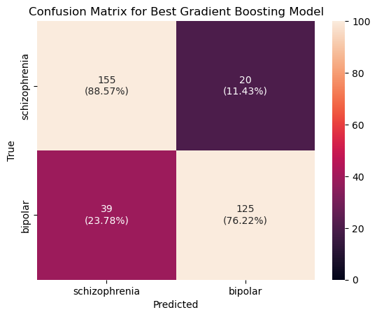
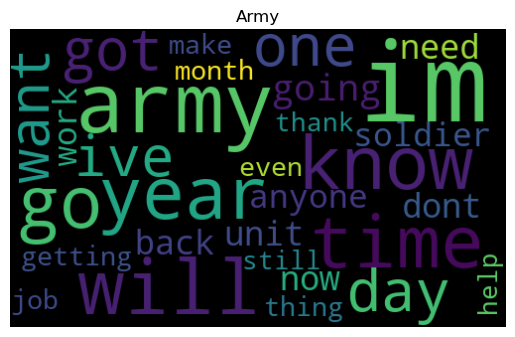
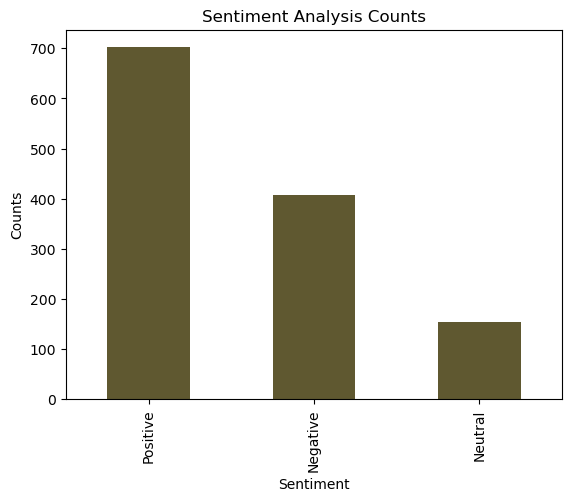
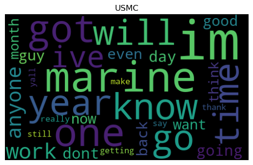
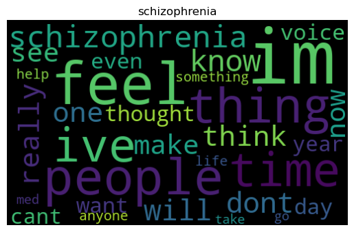
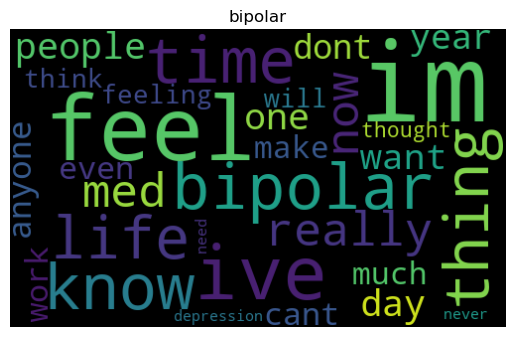
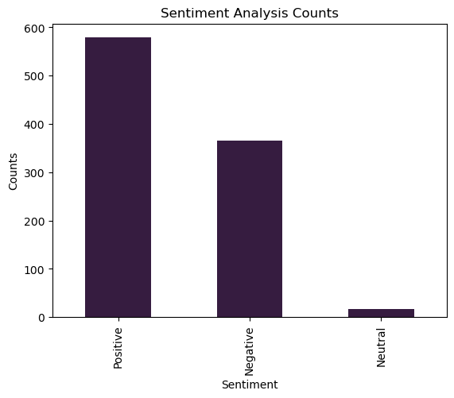

# "Analyzing Community Sentiments in Online Tribes: A Natural Language Processing (NLP) Approach"

## Bottom Line Up Front (BLUF)

This project aims to develop a classification model that leverages Natural Language Processing (NLP) to accurately categorize Reddit posts into specific subreddits., then gauge the sentiment of each group. The primary focus is on military-related subreddits such as United States Army ('army') and United States Marine Corps ('usmc'), along with mental health-related subreddits like 'schizophrenia' and 'bipolar'. [Introduction](#introduction)

### [Goals](#objectives)

1. The primary objective is to create an advanced model capable of analyzing and classifying posts with high accuracy, ensuring that each post is appropriately categorized even when presented with closely related category options. [Methodology](#methodology) & [NLP Analysis](#nlp-analysis)

2. The secondary goal is to understand the morale/sentiment among each group and to gauge the general state of the communities. Additionally, a comparative analysis of sentiment in each subreddit group will be conducted. [Sentiment Analysis](#sentiment-analysis)

### Expected Outcomes:

#### Military Domain:
1. A clearer understanding of the factors affecting military morale, potentially leading to actionable strategies for improvement.
#### Mental Health Domain:
2. Enhanced comprehension of emotional states in individuals with mental health issues, contributing to more effective treatment and support strategies.

### [Outcomes](#outcomes-1)
 

---
# Problem Statement

## Introduction:

Context and Importance:

In today's digital age, social media platforms are hotbeds for various communities, often forming implicit 'tribes'. Recognizing and understanding these communities is crucial for numerous reasons, ranging from improving organizational efficiency to boosting revenue.
The concept is well articulated in "Tribal Leadership: Leveraging Natural Groups to Build a Thriving Organization" by Logan, King, and Fischer-Wright, which emphasizes the value of managing and leading these implicit communities.
### References:

Logan, D., King, J. P., & Fischer-Wright, H. (2011). Tribal leadership: Leveraging natural groups to build a thriving organization. Harper Business.

# Objectives:

### Primary Goal: 
To classify communities using NLP techniques and to identify and analyze sentiments within specific online communities.

---
#### Stretch Goals:
#### 1. Military Morale Analysis:
To assess the morale of military personnel by evaluating sentiments expressed in the 'army' and 'usmc' subreddits. This can assist leadership in identifying and addressing factors influencing troop morale.

#### 2. Mental Health Sentiment Analysis:
To gauge the sentiments of individuals dealing with mental health issues, particularly focusing on the 'schizophrenic' and 'bipolar' subreddits. This insight could aid mental health professionals in recognizing various emotional states and intervening appropriately.
# Methodology:

### Approach:
Employing NLP techniques to process and analyze text data from specified online communities.
Utilizing sentiment analysis algorithms to determine the prevailing emotional tones within these communities.

### 1. Data Collection

- Data was collected using a Reddit API to scrape posts from the following subreddits:
  - `army`
  - `usmc`
  - `schizophrenic`
  - `bipolar`
- The token credentials were stored in a separate json file for security and to reduce redundancy and imported into the notebook.
- The data collection process was optimized by creating a python script which ran daily to obtain a larger dataset for each subreddit.
- The data was then compiled, duplicates were removed and each separate reddit was saved as a CSV file, and an aggregated DataFrame was concatenated for further processing.

### 2. Data Cleaning & Exploratory Data Analysis (EDA)

- The data was cleaned by:
    - Removing null values
    - Feature engineering
    - Imputing missing values
    - Normalizing and encoding data
- Although duplicates were removed in the data collection process, the data was rechecked for duplicates to ensure that no duplicates were present in the final dataset.

### 3. Preprocessing & Modeling

- The preprocessing steps included:
    - Removing HTML tags
    - Removing URLs
    - Removing special characters
    - Removing punctuation
    - Removing numbers
    - Removing stopwords
    - Lemmatizing words
    - Vectorizing the text data using TF-IDF Vectorizer
    - Splitting the data into training and testing sets
    - Scaling the data using StandardScaler
- The modeling process included:
    - Creating a baseline model
    - Creating a Logistic Regression model
    - Creating a Multinomial Naive Bayes model
    - Creating a Random Forest model
    - Creating a K-Nearest Neighbors model
    - Creating a Gradient Boosting Classifier model

### 4. Evaluation and Conceptual Understanding

- Evaluated the model's performance based on the following metrics:
    - Recall
    - Precision
    - Accuracy
    - F1 Score
    - Macro Average
    - Weighted Average
- Compared the models' performance and selected the best model based on the metrics above.
- Analyzed the model's coefficients to determine the most important features in predicting the subreddit category.
- Analyzed the model's confusion matrix to determine the most common misclassifications.
- Used the best model to predict the subreddit category for the test data, and analyzed the results.
- The words with the highest and lowest coefficients were analyzed from the best model in order to evaluate the group's morale and sentiment.

### 5. Conclusion and Recommendations

- Best model: TD-IDF Vectorizer with Gradient Boosting Classifier
1. Military: 

    
    

#
<table border="1" class="dataframe">
  <thead>
    <tr style="text-align: right;">
      <th></th>
      <th>precision</th>
      <th>recall</th>
      <th>f1-score</th>
      <th>support</th>
    </tr>
    <tr>
      <th>Class</th>
      <th></th>
      <th></th>
      <th></th>
      <th></th>
    </tr>
  </thead>
  <tbody>
    <tr>
      <th>Army</th>
      <td>0.81</td>
      <td>0.98</td>
      <td>0.88</td>
      <td>253.0</td>
    </tr>
    <tr>
      <th>USMC</th>
      <td>0.86</td>
      <td>0.33</td>
      <td>0.48</td>
      <td>90.0</td>
    </tr>
    <tr>
      <th>accuracy</th>
      <td></td>
      <td></td>
      <td>0.81</td>
      <td></td>
    </tr>
    <tr>
      <th>macro avg</th>
      <td>0.83</td>
      <td>0.66</td>
      <td>0.68</td>
      <td>343.0</td>
    </tr>
    <tr>
      <th>weighted avg</th>
      <td>0.82</td>
      <td>0.81</td>
      <td>0.78</td>
      <td>343.0</td>
    </tr>
  </tbody>
</table>

2. Mental Health:

    
    

#
<table border="1" class="dataframe">
  <thead>
    <tr style="text-align: right;">
      <th></th>
      <th>precision</th>
      <th>recall</th>
      <th>f1-score</th>
      <th>support</th>
    </tr>
    <tr>
      <th>Class</th>
      <th></th>
      <th></th>
      <th></th>
      <th></th>
    </tr>
  </thead>
  <tbody>
    <tr>
      <th>bipolar</th>
      <td>0.78</td>
      <td>0.91</td>
      <td>0.84</td>
      <td>175.0</td>
    </tr>
    <tr>
      <th>schizophrenia</th>
      <td>0.88</td>
      <td>0.73</td>
      <td>0.80</td>
      <td>164.0</td>
    </tr>
    <tr>
      <th>accuracy</th>
      <td></td>
      <td></td>
      <td>0.82</td>
      <td></td>
    </tr>
    <tr>
      <th>macro avg</th>
      <td>0.83</td>
      <td>0.82</td>
      <td>0.82</td>
      <td>339.0</td>
    </tr>
    <tr>
      <th>weighted avg</th>
      <td>0.83</td>
      <td>0.82</td>
      <td>0.82</td>
      <td>339.0</td>
    </tr>
  </tbody>
</table>

- These models are performing well and improving with each iteration. The model should be retrained with the new data to determine if the performance has improved.

 
 

# Outcomes:

## NLP Analysis:
- Military: `TD-IDF + Gradient Boosting`, The similarities of the posts during this season may have affected the results. The data collection process should be repeated during a different time of year to determine if the results are consistent.
- Mental Health: `TD-IDF + Gradient Boosting`, Although these groups have an appearance of similarity, the model was able to distinguish between them with a higher accuracy than that of similar military groups, but at a slower learning rate.

### Classification Report and Confusion Matrix

- Military: `TD-IDF + Gradient Boosting`,

[Classification Report](./4_CONCLUSIONS_VIZ/files/classification_report_best_gb.csv)

[Confusion Matrix](./4_CONCLUSIONS_VIZ/imgs/best_gb.png)

- Mental Health: `TD- IDF + Gradient Boosting`

[Classification Report](./4_CONCLUSIONS_VIZ/files/classification_report_best_gb_mh.csv)

[Confusion Matrix](./4_CONCLUSIONS_VIZ/imgs/mh_best_gb.png)

## Sentiment Analysis:

- The sentiment analysis was conducted using the TextBlob Sentiment Analyzers.
- Compared the sentiments amongst each grouped subreddits.

### Word Cloud Generation

- a. Army: Word Clouds and Sentiment Analysis
    -  
    - 
- b.  USMC: Word Clouds and Sentiment Analysis
    - 
    - 
- c.  Schizophrenia: Word Clouds and Sentiment Analysis
    - 
    - 
- d.  Bipolar: Word Clouds and Sentiment Analysis
    - 
    - 

# Final Thoughts
Improvements:
- The data collection began during the holiday season, which may have affected the results. The data collection process should be repeated during a different time of year to determine if the results are consistent. 
- The data collection record keeping process should be improved to ensure that the data is collected consistently and accurately. Capturing the results of each iteration of the models would be beneficial for future analysis.
- Each iteration has seen an improvement in the model's performance. The model should be retrained with the new data to determine if the performance has improved.

Findings and Further Applications:
- This model and its outputs can be applied to other domains, such as *marketing, politics, and social sciences*, more interestingly in the `Human Resources` domain, as it can be used to gauge employee morale and sentiment. As discussed in the Tribal Leadership book, this can give insight into the group's mentality without sacrificing anonymity using the NLP model to decipher which group the sentiment comes from. Using this information leaders can determine the effectiveness of various HR initiatives and programs, and possibly of reducing employee turnover/CHURN.
